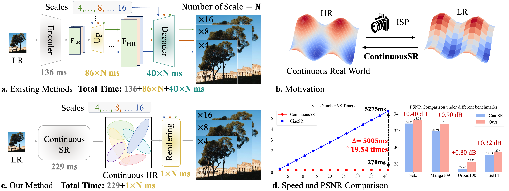

# ContinuousSR
Pixel to Gaussian: Ultra-Fast Continuous Super-Resolution with 2D Gaussian Modeling
Long Peng<sup>1,3</sup>†, Anran Wu<sup>1,2</sup>†, Wenbo Li<sup>3</sup>*, Peizhe Xia<sup>1</sup>, Xueyuan Dai<sup>4</sup>, Xinjie Zhang<sup>5</sup>, Xin Di<sup>1</sup>, Haoze Sun<sup>6</sup>, Renjing Pei<sup>3</sup>, Yang Wang<sup>1,4*</sup>, Yang Cao<sup>1</sup>, Zheng-Jun Zha<sup>1</sup>

<sup>1</sup>USTC, <sup>2</sup>AHU, <sup>3</sup>Huawei Noah’s Ark Lab, <sup>4</sup>Chang’an University, <sup>5</sup>HKUST, <sup>6</sup>THU

[[Arxiv Paper]]&nbsp;
[[Website Page]]&nbsp;
[[Google Drive]]&nbsp;
[[Baidu Disk]]&nbsp;
[[Colab Notebook]]&nbsp;

&nbsp;

ContinuousSR is a fast, arbitrary-scale super-resolution method that reconstructs high-resolution images from low-resolution inputs using a Pixel-to-Gaussian paradigm. Unlike traditional methods, ContinuousSR eliminates time-consuming upsampling by building a Gaussian field in a single pass, allowing rendering in just 1ms per scale. Our approach enhances reconstruction quality through Deep Gaussian Prior and Adaptive Position Drifting, achieving significant improvements and a 19.5× speedup across forty scales.

## Preparation
### Dependencies and Installation
- python=3.9
- pytorch=1.13
- basicsr==1.3.4.9
- Others:

```bash
git clone https://github.com/XingtongGe/gsplat.git
cd gsplat
pip install -e .[dev]
```

## Get Started
### Inference
Here is an example command for inference
```bash
# test Set5 X4
python test.py --config ./configs/test/test-set5-4.yaml --model ContinuousSR.pth
```

## Visual Examples
&nbsp;
